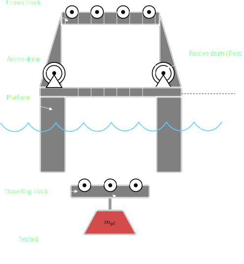
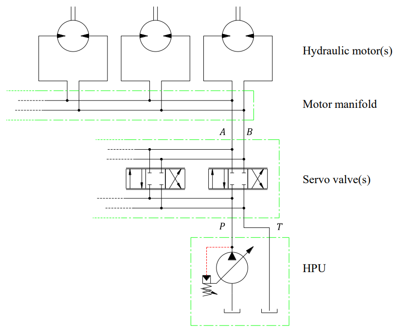
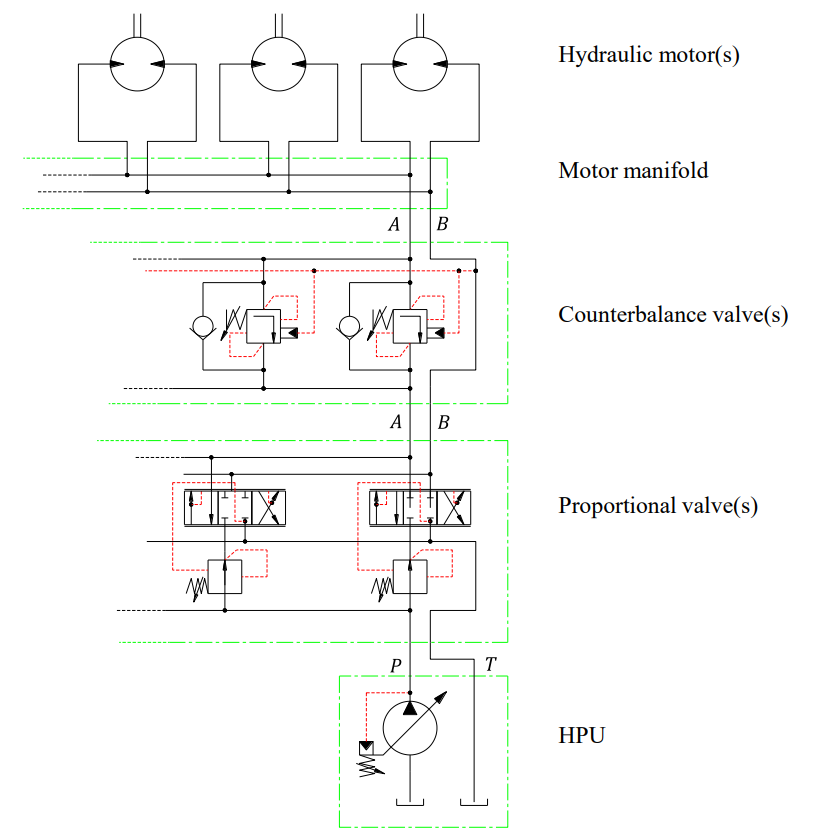

# MAS410 Project: Heave Compensator

*Project for the MSc. course MAS410 Hydraulic Components and Systems*

 \
The project's primary focus is to make a heave compensator for the 
system shown above with design and control of two hydraulic circuits:

**Circuit A:** Servo Valve &nbsp;&nbsp;&nbsp;&nbsp;&nbsp;&nbsp;&nbsp;
&nbsp;&nbsp;&nbsp;&nbsp;&nbsp;&nbsp;&nbsp;&nbsp;&nbsp;&nbsp;&nbsp;&nbsp;
&nbsp;&nbsp;&nbsp;&nbsp;
&nbsp;&nbsp;&nbsp;&nbsp;&nbsp;&nbsp;&nbsp;&nbsp;&nbsp;&nbsp;&nbsp;&nbsp;
&nbsp;&nbsp;&nbsp;&nbsp;&nbsp;&nbsp;&nbsp;&nbsp;&nbsp;&nbsp;&nbsp;&nbsp;
**Circuit B:** Pressure Compensated Proportional Valve & CBV

## Literature

- Curriculum from MAS410 course
- Lecture 5 from MAS419 (under simscape folder in CWD)
- Project Supplements
  - PL1: Circuit B Equations
  - PL2: Circuit B Simulation
