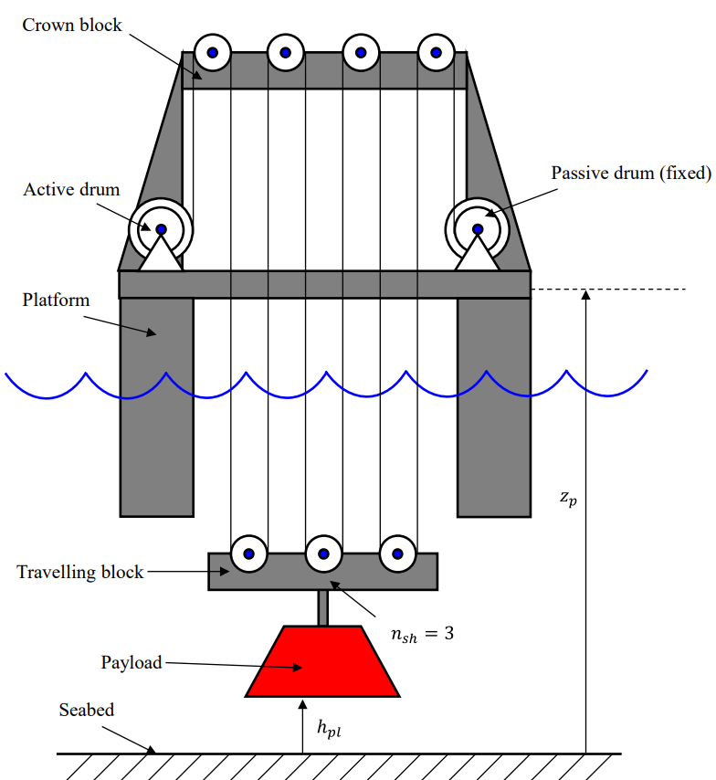

# MAS410 Project: Heave Compensator

*Project for MAS410 Hydraulic Components and Systems*

 \
The project's primary focus is to make a heave compensator for the 
system shown above with design and control of two hydraulic circuits:

**Circuit A:** Servo Valve &nbsp;&nbsp;&nbsp;&nbsp;&nbsp;&nbsp;&nbsp;
&nbsp;&nbsp;&nbsp;&nbsp;&nbsp;&nbsp;&nbsp;&nbsp;&nbsp;&nbsp;&nbsp;&nbsp;
&nbsp;&nbsp;&nbsp;&nbsp;
&nbsp;&nbsp;&nbsp;&nbsp;&nbsp;&nbsp;&nbsp;&nbsp;&nbsp;&nbsp;&nbsp;&nbsp;
&nbsp;&nbsp;&nbsp;&nbsp;&nbsp;&nbsp;&nbsp;&nbsp;&nbsp;&nbsp;&nbsp;&nbsp;
**Circuit B:** Proportional Valve & CBV config

## Litterature

- The project uses the curriculum from the MAS410 course
- Also lecture 5 from MAS419 (under simscape folder in CWD)