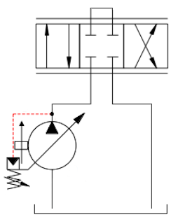
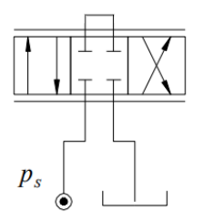
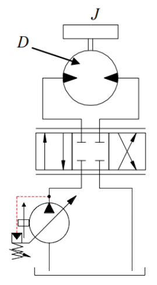
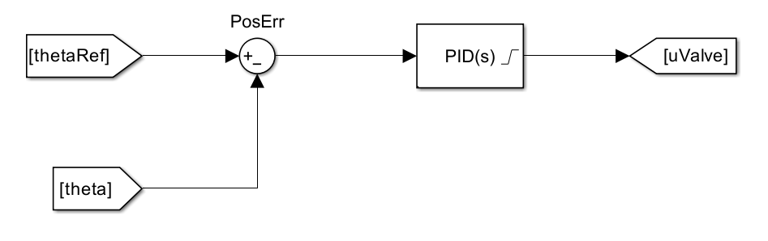

# MAS410 Project Supplement: MAS419 Lecture 5

The files in this folder serve as templates and are not to be 
changed from now on \
*(including SimpleServo**N**_editTLS.slx)*

## Overview

### Lecture Model 11.09.2024
---
- lecture5_example_11092024.slx

The model made in the MAS419 class was originally done in class, 
but re-done in this folder 100%

Short circuit with ramped up pressure

### Video Model from Canvas
---
- lecture5_modelFromScratch_canvas.slx

The model is made from the older supplementary videos in canvas

Setup for L8_p2, but **missing hydraulic servo motor, 
inertia, closed-loop control**

### Simple Servo 1
---
- Edited: SimpleServo1_editTLS.slx
- Original: Simple_Servo_Simscape_1.slx

This is essentially the same as the one in the lecture 11.09.2024.

Variable displacement pump w/o motor

> *"Supply pressure 70 bar, servo valve rated to 100 l/min @ 70 bar, 
servo valve fully opened and A - B port short circuited"*

### Simple Servo 2
---
- Edited: SimpleServo2_editTLS.slx
- Original: Simple_Servo_Simscape_2.slx

Variable displacement pump with motor

> *"Supply pressure 200 bar, servo valve rated to 100 l/min @ 70 bar, 
servo valve fully opened, ideal (no losses) hydraulic motor 125 
cm^3/rev inserted in A - B connection, external load ML (corresponding 
to 100 bar pressure drop across motor), and 0.1 kgm^2 inertia added 
to motor output shaft"*

### Simple Servo 3
---
- Edited: SimpleServo3_editTLS.slx
- Original: Simple_Servo_Simscape_3.slx

Variable displacement pump with motor and position control

> *"Supply pressure 200 bar, servo valve rated to 100 l/min @ 70 bar, 
ideal (no losses) hydraulic motor 125 cm^3/rev inserted in A - B 
connection, external load ML (corresponding to 100 bar pressure 
drop across motor), and 0.1 kgm^2 inertia added to motor output shaft. 
Reference sinusoidal motion of motor output shaft introduced and 
used in closed loop control (P-controller) using servo valve as 
control element"*

## Lecture Notes

Notes taken in MAS419 book, images here